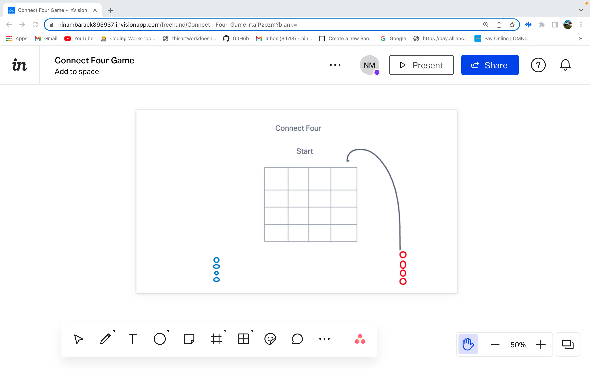

# Connect 4
Connect Four 

# Connect Four Pitch
First Four is a two-player board game in which the players first choose a color and then take turns dropping one colored disc from the top into a seven-column, six-row vertically suspended grid. The pieces fall straight down, occupying the lowest available space within the column.
The mission for the game is to be the first to form a horizontal, vertical, or diagonal line of four of one's own discs. 
  

# wireframe

# Tech stack
HTML
CSS
JavaScript
Vanilla DOM

# MVP Goals
user clicks button to start the game 
Winn is reflected as soon as the four colors are matched 
draw conditions to restart the game
  

# stretch Goals
Accumulate gems upon winning 5 times a row 
Using an AI to compete with user 
Letting user invite to play with friends  

# potential Roadblocks
Algorithm for an AI to learn the game and is never defeated

